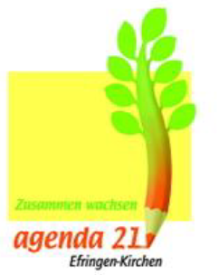

```{r setup, include=FALSE,message=FALSE}
library(dplyr)
library(DT)
knitr::opts_chunk$set(echo = TRUE)
```

```{r out.width="10%",fig.align="left",echo=FALSE}

```

```{r data_get,echo=FALSE}
dat.term<-read.csv("Termine.csv",header = TRUE)
dat.term<-data.frame(dat.term)
dat.term$Webseite<-ifelse(dat.term$Web=="", "", paste0('<a href="',dat.term$Web,'">',dat.term$Web,"</a>"))
dat.fin<-subset(dat.term,select=c(Datum,Bis,Ort,Details,Organisator,Webseite))
datatable(dat.fin, escape=FALSE, rownames = FALSE,
          extensions = 'Buttons',
          options = list(dom = 'Bfrtip', 
                         buttons = c('copy', 'pdf', 'print')))
```
